# FFmpeg-Filter-Compose

[Filtergraph](https://ffmpeg.org/ffmpeg-filters.html#Filtergraph-description) generator with composing API for [FFmpeg](https://ffmpeg.org/).

API References: https://xeroalpha.github.io/ffmpeg-filter-compose/

## Install

NPM: [ffmpeg-filter-compose](https://www.npmjs.com/package/ffmpeg-filter-compose)

```
npm i ffmpeg-filter-compose
```

We recommend to use it with [ffmpeg-filter-compose-extension](https://github.com/XeroAlpha/ffmpeg-filter-compose/blob/main/extensions/README.md)!

## Examples

> Blue parts of the graph is auto-generated by `filterComplex`.

Basic chain:
```js
filterComplex(({ from, input, filter }) => {
    const [videoOutput] = from(input[0].v)
        .pipe(filter.crop([400, 200, 12, 34]))
        .pipe(filter.scale({ w: 200, h: 100 }));
    return { videoOutput };
})
// => `[0:v]crop=400:200:12:34,scale=w=200:h=100[videoOutput]`
```


Multiple inputs and outputs:
```js
filterComplex(({ from, input, filter, split }) => {
    const [{ v: video }] = input;
    const [main, tmp] = split(video);
    const [flip] = from(tmp)
        .pipe(filter.crop(['iw', 'ih/2', 0, 0]))
        .pipe(filter.vflip);
    const [out] = from(main, flip).pipe(filter.overlay([0, 'H/2']));
    return { out };
})
// => `[0:v]split[_1][_2];[_2]crop=iw:ih/2:0:0,vflip[_3];[_1][_3]overlay=0:H/2[out]`
```


Apply filter conditionally:
```js
await filterComplex(async ({ from, input, filter }) => {
    let video = input[0].v;
    if (await fetchNegate()) {
        [video] = from(video).pipe(filter.negate);
    }
    return { video };
})
// => `[0:v]negate[video]` or `[0:v]null[video]`
```

Apply fade-in effect, then concatenate videos:
```js
filterComplex(({ from, input, filter, concat }) => {
    const inputArr = input.toArray(videoCount);
    const [outv, outa] = concat()
        .video(...inputArr.map((e) => e.v).map((v) => {
            const [fade] = from(v).pipe(filter.fade({ t: 'in', d: 1 }));
            return fade;
        }))
        .audio(...inputArr.map((e) => e.a));
    return { outv, outa };
})
// => `[0:v]fade=t=in:d=1[_1];[1:v]fade=t=in:d=1[_2];[_1][0:a][_2][1:a]concat=n=2:v=1:a=1[outv][outa]`
```


Complex example:
```js
filterComplex(({ from, use, pipe, filter }) => {
    const L1 = pipe('L1');
    const L2 = pipe('L2');
    use(filter.testsrc)
        .link(use(filter.split).connect(L1))
        .link(use(filter.hflip).connect(L2));
    const [out] = from(L1, L2).pipe(filter.hstack);
    return { out };
})
// => `testsrc,split[L1],hflip[L2];[L1][L2]hstack[out]`
```


Automatic split insertion:
```js
filterComplex(({ from, use, filter }) => {
    const [testVideo] = use(filter.testsrc).mark('video');
    const [flipped] = from(testVideo).pipe(filter.hflip);
    const [out] = from(testVideo, flipped).pipe(filter.hstack); // testVideo is used twice!
    return { out };
})
// => `testsrc[_1];[_3]hflip[_2];[_4][_2]hstack[out];[_1]split[_3][_4]`
```


Send commands:
```js
filterComplex(({ from, input, filter, command }) => {
    const atempo = filter.atempo().ref('my');
    const asendcmd = command(({ when }) => {
        when(4.5).onEnter(atempo, 'tempo', 1.5);
    }).toFilter('audio');
    const [out] = from(input[0].a).pipe(asendcmd).pipe(atempo);
    return { out };
})
// => `[0:a]asendcmd='4.5 [enter] atempo@my tempo 1.5',atempo@my[out]`
```

Deferred generation:
```js
const context = filterComplex();
let chain = context.from(context.input[0].v);
chain = chain.pipe(context.filter.setpts('N/(60*TB)'));
// ......
const [out] = chain;
context.complete({ out });
// => `[0:v]setpts=N/(60*TB)[out]`
```

Extension:
```ts
declare module 'ffmpeg-filter-compose' {
    interface FilterComplexContext {
        select: (input: Pipe, expr: string) => Iterable<Pipe>;
    }
}

FilterComplexContext.select = function*(input, expr) {
    const filter = this.filter.select();
    const chain = this.from(input.mark('video')).pipe(filter);
    let outputCount = 0;
    for (const pipe of chain) {
        outputCount++;
        filter.setArguments({ n: outputCount, e: expr });
        yield pipe;
    }
}

filterComplex(({ from, input, filter, select }) => {
    const [odd, even] = select(input[0].v, 'mod(n,2)+1');
    const [tmp] = from(odd).pipe(filter.pad({ h: '2*ih' }));
    const [out] = from(tmp, even).pipe(filter.overlay({ y: 'h' }));
    return { out };
})
// => `[0:v]select='n=2:e=mod(n'\\,'2)+1'[_1][_2];[_1]pad=h=2*ih[_3];[_3][_2]overlay=y=h[out]`
```


## FAQ

Q: Why can't I use the spread operator (`...`)?

A: The spread operator (`...`) cannot be used in this context because we don't have knowledge of the exact input count or filter pad count. Since they are infinite iterable, using the spread operator could potentially produce an infinite number of objects. To address this, you can use the `toArray()` or `fork()` methods to explicitly specify the count of objects.

Q: What is the purpose of `pipe.mark()`? When should I use it?

A: The `pipe.mark()` function is used to specify the media type of a pipe, which helps determine the relevant filter to be applied. For example, when using the `split()` function, specifying the media type with `pipe.mark()` ensures that the appropriate filter, such as `split` for video or `asplit` for audio, is applied.

Q: How can I resolve the error message `Pipe [pipe] is not bound to any input`?

A: This error message indicates that the `[pipe]` object is neither passed to `from().pipe` nor returned from the callback function. To resolve this issue, you should explicitly call the `recycle()` method with the `[pipe]` object to ensure it is properly handled.
