# FFmpeg-Filter-Compose-Extension

Extension for [FFmpeg-Filter-Compose](https://github.com/XeroAlpha/ffmpeg-filter-compose).

> [!note]
> The module version must correspond to the FFmpeg version. The current version is compatible with FFmpeg 7.0.1.

## Install

NPM: [ffmpeg-filter-compose-extension](https://www.npmjs.com/package/ffmpeg-filter-compose-extension)

```
npm i ffmpeg-filter-compose-extension
```

## Usage

First, Import it!
```js
import { filterComplex } from 'ffmpeg-filter-compose';
import 'ffmpeg-filter-compose-extension';
```

Then, use it as you like! No need to care about split filters!
```js
filterComplex(({ movie, scale, histogram, showfreqs, hstack }) => {
    const [video, audio] = movie({ filename: 'test.mp4', s: 'dv+da' });
    const out = hstack(3, scale(video, '640x360'), scale(histogram(video), '640x360'), showfreqs(audio, { s: '640x360' }));
    return [out, audio];
})
// => `movie=filename=test.mp4:s=dv+da[_1][_2];[_4]scale=640x360[_3];[_5]histogram[_6];[_1]split[_4][_5];[_6]scale=640x360[_7];[_10]showfreqs=s=640x360[_8];[_3][_7][_8]hstack=3[out0];[_2]asplit[_10][out1]`
```

